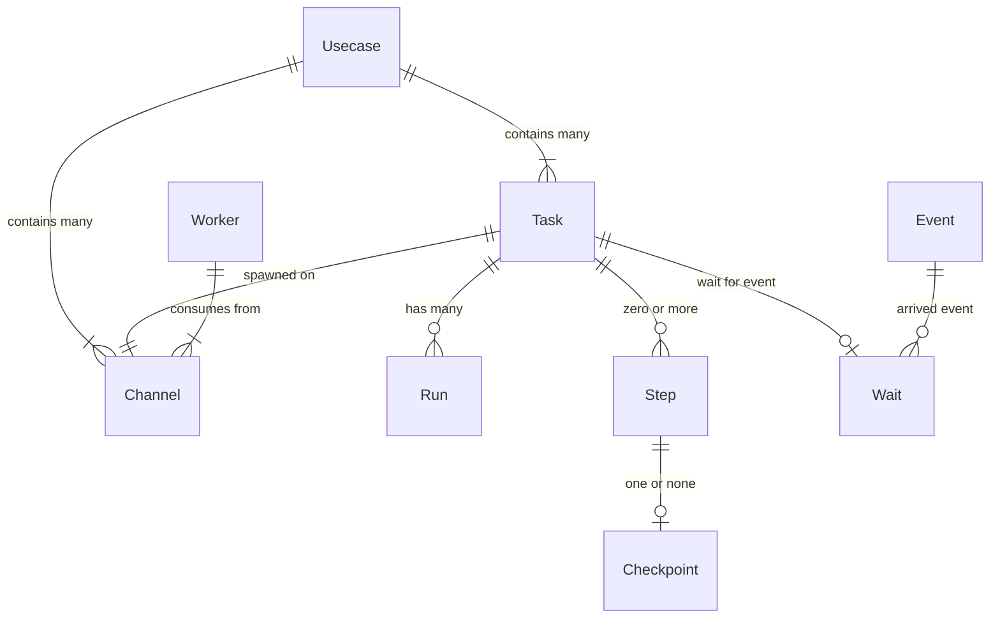

# Taskturbine

Taskturbine is a cross-language durable task framework for Rust & Python, using postgres for task storage.

## What are durable tasks?

Durable tasks are operations that are resilient to failure and interruptions. Instead of having
to manually manage retries, state and scheduling, you express your logic as a workflow of 
operations or functions. Each 'step' in a durable task will store its result, and will
resume from the last completed step.

```python
import os
from taskturbine import TaskturbineApp, Config, TaskContext

config = Config(
    database_url=os.getenv("DB_URL"),
    app_module="testapp:app",
    worker_concurrency=4,
)
app = TaskturbineApp(config)


@app.register_task("hello-world")
def hello_world(ctx: TaskContext) -> None:
    logger.info(f"Hello world! {ctx.params_bytes.decode()}")

    # We start off defining the steps in our task.
    @ctx.step(name="compute_user_data")
    def compute_user_data(ctx: TaskContext) -> Payload:
        params = ctx.params
        # do some compute/query and returns a dict value.
        return {"name": params["name"], "id": uuid.uuid4().hex, "started": time.time()}
        
    @ctx.step(name="send-email")
    def send_email(ctx: TaskContext, user: Payload, event: Payload) -> Payload:
        email.send_message("hello-user", data={"user": user, "event": event})

    @ctx.step(name="process-complete")
    def process_complete(ctx: TaskContext, user: Payload, event: Payload) -> Payload:
        # Do more IO
        return user

    # Once we have defined our steps, we wire them together with control flow.
    # Steps have their return values stored and if a step/task fails, it will
    # resume from the last completed step.
    # Any logic in the task body will be run *each* time the task is executed.
    user = compute_user_data(ctx)
    assert user, "User must exist"
    send_email(ctx, user)

    completed = process_complete(ctx, user, event)

    print("Completed:", completed)
```

Taskturbine provides a simple durable cross-platform task framework for Rust,
and Python. Using postgres as both a queue and state storage allows taskturbine
to be operationally simple yet provide powerful features like retries,
scheduling, workload separation, external synchronization and more.

## Installation

For python:

```bash
uv add taskturbine
```

For python:

```bash
cargo add taskturbine
```

## Concepts

Application logic is defined as _tasks_. Tasks are functions that are composed of multiple
operations or _steps_. Tasks execute their steps in the order they are defined, and the result
of each step is stored. Should a task or step fail for any reason, a subsequent _run_ can be
scheduled. When the subsequent run is started, the application state is reconstructed from
stored _checkpoints_, and any completed steps are skipped. Tasks can also _sleep_ for a period
of time, or wait for an _event_ to be emit elsewhere in your application logic. Event payloads
are also stored allowing you to build race free synchronization logic and workflows.

As an application grows, you'll likely want to isolate different workloads from each
other. To facilitate this, tasks can be _spawned_ into a named _channel_. Workers
claim and execute tasks from one or more channels. This enables you to have different
groups of workers for different workloads or customers.

## Glossary

- `usecase` The client application that a task belongs to. A single taskturbine
  database can be shared by multiple applications if required.
- `channel` Channels enable you to separate workloads within a `usecase`. For example, you may
  want many workers processing high-priority tasks, and fewer processing lower priority work.
- `task` A workflow or task that should be executed durably.
- `step` An incremental operation or side-effect that can succeed or fail. Steps
  act as error and persistence boundaries for your tasks. Steps that complete are not
  retried or run multiple times.
- `checkpoint` As steps are completed, checkpoints are created.
- `run` An attempt to execute a task. Each run can read checkpoints from previous
  runs, allowing tasks to resume where they left off.
- `event` Tasks can be suspended until named events are emit by the application. Events are
  ideal for waiting on webhooks, or other tasks to complete.
- `wait` When a task is waiting for an event, it records a `wait`.

This diagram connects each of the concepts and glossary terms together:



## Command line tools

The `taskturbine-cli` package provides a command line tool for managing and interacting with a taskturbine application.
With taskturbine-cli you can:

- Spawn tasks
- Emit events
- Perform cleanup operations.
- Clear all stored tasks + events.
- Create schema

## Comparisons

TODO

## Project History

The schema and library interfaces were inspired by
[Absurd](https://github.com/earendil-works/absurd). However, instead of leaning
on stored procedures, the 'core' library interface is implemented as a rust
crate, and libraries are provided for both Rust and Python, with more language
support planned in the future.

## License

Apache 2.0 License

Copyright 2025 earendil-works
Copyright 2025 Mark Story
